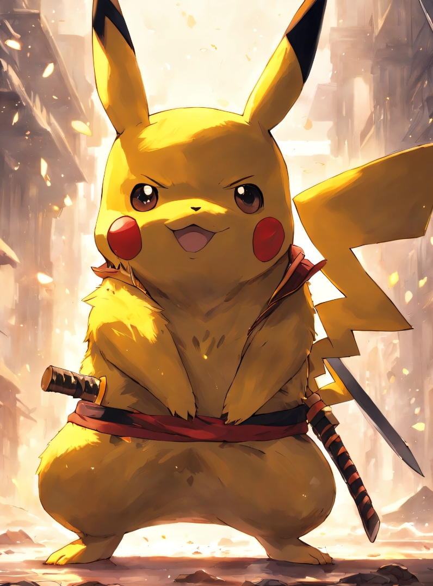

# SAMURAI ENGINE

- SAMURAI ENGINE is a light weight, highly customizable game engine written purely in C++ and allows for the creation of 2D games.

- Theroetically, the engine is designed to be able to run any 2D game written with SDL2 renderer and most of the game renderer is written in OpenGL3.3 or higher version.
- The engine supports hot reloading of gameplay logic with optimized compile time, allows for actively change logic of game while running. Faster prototyping than using scriptable languages, such as Lua and python.
- The engine is designed to be able to run on Windows.
<!--
I do this mainly because I do think that using sciptable object is a good method to make rapid change when prototyping or index changing. But putting all the game loop logic in scriptable languages, such as Lua and python, it will not be a good idea because when you want to change parameters of functions, you have to change the script binding and reload everything. This will eventually slow down the development of game.
-->
- 3 scenes are made as demos to show the feature of the engine.

## Features
- [&#9745;] **Multi Renderer Support**: The engine supports both SDL2 and OpenGL3.3 renderer.

- [&#9745;] **High Compatibility**: The engine is designed to be able to run any 2D game written with SDL2 renderer.
- [&#9745;] **Hot Reloading**: The engine supports hot reloading of gameplay logic with optimized compile time.
- [&#9745;] **Asset Management**: The engine is implemented with a asset manage system.
- [&#9745;] **Gui-based Editor**: Using ImGui to create a simple editor.
- [&#9745;] **Scene Editor**: Scene editor is implemented and allow user to create scene with Gui while running to play the game in real time.
- [&#9745;] **Data Driven**: The engine is designed to be data driven. Everthing is loaded on the fly.
- [&#9745;] **Multi-Game Instance**: Allows user to run multiple game instance at the same time.
- [&#9745;] **Short Cut Customizable**: Allows user to configure the short cut of the engine.
- [&#9745;] **Memory Consumption Demo**: Real time memory consumption is shown in the engine.

## Prerequisites
- [SDL2](https://www.libsdl.org/download-2.0.php): Simple Direct Media Layer is a cross-platform development library.
- [glad](https://glad.dav1d.de/): OpenGL loader
- [gl2d](https://github.com/meemknight/gl2d): simple 2D rendering library made with OpenGL
- [glm](https:://github.com/g-truc/glm): header only C++ mathematics library for graphics software based on the OpenGL Shading Language (GLSL) specifications.
- [ImGui](https://github.com/ocornut/imgui): Bloat-free Immediate Mode Graphical User interface for C++ with minimal dependencies
- [glfw](https://github.com/glfw/glfw): A multi-platform library for OpenGL, OpenGL ES, Vulkan, window and input
- [stb](https://github.com/nothings/stb): single-file public domain libraries for C/C++

Luckily you only need to download the sdl2 and cmake needs to find config files of sdl2 to build. Other libraries are included in the project.

## How To Build
- Build By CMake
```shell
cmake -S . -B build
# Only Support Windows right now
```
## How To Run
- **Run the engine with OpenGL renderer** :
  
  0. In core/CoreConfig.h, set the SAMURAI_SDL to 0

  1. Open Visual Studio and build the project.
  2. set the startup project to [core] and build the project.
  3. build the project [gameplay].
  4. go to the build directory and run the engine.

- **Run the engine with SDL2 renderer** :
  
  0. In core/CoreConfig.h, set the SAMURAI_SDL to 1

  1. Repeat the steps above.

**Important**: Make sure all compiled .dll file is in the std::filesystem::path::current_path() directory.

## **DEMO**
**Demo of the engine is shown in the video below:**

[](https://youtu.be/BkoaDMFHNX8)


## **CITES AND CREDITS**
0. [ChatGPT](https://www.openai.com/research/chatgpt/) : I made a good friend with ChatGPT while developing the engine. It helped me a lot when I was stuck in the development.
1. [Cherno's Game Engine Series](https://www.youtube.com/playlist?list=PLlrATfBNZ98dC-V-N3m0Go4deliWHPFwT) : The engine is inspired by Cherno's Game Engine Series, I followed his series to build the core of the engine. I have to say I learned a lot from his series. The ImGui editor part and hot reloading part is referenced from his series.
2. [Mike Shah's Game Engine Series](https://mshah.io/comp/Spring24/GameEngines/public/index.php) : The Data Driven design of the engine is inspired by Mike Shah's Game Engine Series while reuse the code from his course.
3. [CS107 Stanford](https://web.stanford.edu/class/archive/cs/cs107/cs107.1212/) : The memory allocator part in cpp is inspired by CS107 Stanford. And I reused my code from the final assignment I submitted of CS107.
4. [Low Level Learning C++ Series](https://www.youtube.com/@LowLevelLearning/videos) : The memory allocator part in cpp is inspired by Low Level Learning C++ Series.

5. [OpenGL Tutorial](https://learnopengl.com/) : The OpenGL part of the engine is inspired by OpenGL Tutorial.
6. [ImGui and SDL2 Setup Tutorial](https://www.youtube.com/watch?v=2MHOGTw1GC0): The ImGui and SDL2 setup part is learned and applied with this tutorial.

## Engine Structure

**Project Website**: [CLICK HERE AND I TAKE YOU TO THE RABBIT HOLE](https://phantom23333.github.io/projects/)

## Project Hieararchy


### Engine Directory Organization

- Docs 
    - Source Code Documentation
- Resources
    - Art assets (With the Sub directories music, sound, images, and anything else)
- Editor
    - ImGui Editor
- Gameplay
    - Game Logic
- Runtime 
    - Controller during the runtime and solely for editor
- Shared
    - Controller and renderer shared between editor and gameplay
- ThirdParty
    - Code that you have not written if any.


## Post Mortem

*TODO*: SDL_INPUT: SDL_Event is a poll event system while the glfw is using the callback event system. This two system's difference lead to the reflection of keyboard is hard when switch the compile mode manually. The reflection of keyboard is not working well when using the SDL renderer and compile.

*TODO*: 3D_Renderer capability is not implemented. In future, I could using the Vulkan realtime ray tracing renderer I made before to implement into the engine.

*TODO*: Cotainer information refactor, right now I made two custom class that could create so called static string in the container to ensure the information won't be lose when I close the container window or reload the .dll file. Maybe I could use another way to refactor the code inorder to simplify the code.